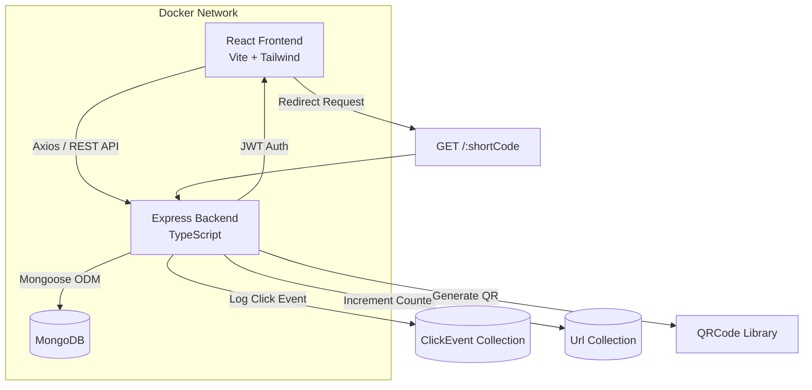
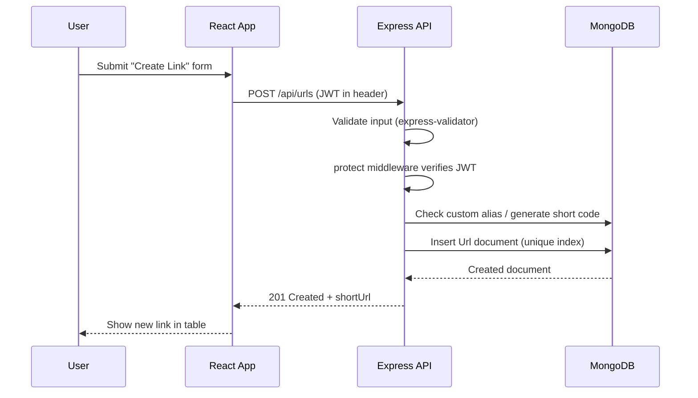
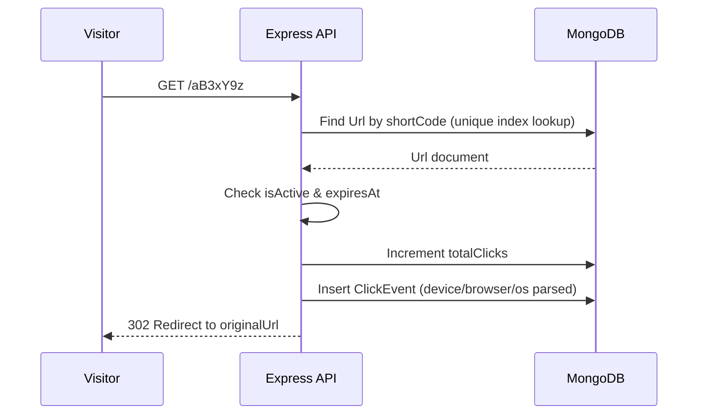

# ShortLink Pro

A production-quality, full-stack URL Shortener SaaS application built with the **MERN stack** (MongoDB, Express, React, Node.js) and **TypeScript**. ShortLink Pro lets users create branded short links, generate QR codes, and track detailed click analytics through a modern, responsive dashboard.

> Built as a portfolio-grade project demonstrating production architecture, security best practices, and a polished SaaS UI suitable for internship/placement applications.

---

## Table of Contents

1. [Features](#features)
2. [Tech Stack](#tech-stack)
3. [Folder Structure](#folder-structure)
4. [Architecture Diagram](#architecture-diagram)
5. [Database Design](#database-design)
6. [System Design Notes](#system-design-notes)
7. [Getting Started (Local Development)](#getting-started-local-development)
8. [Environment Variables](#environment-variables)
9. [API Documentation](#api-documentation)
10. [Docker Deployment](#docker-deployment)
11. [Cloud Deployment Guides](#cloud-deployment-guides)
12. [Security Features](#security-features)
13. [Future Improvements](#future-improvements)

---

## Features

### Authentication & Authorization
- User registration & login with JWT
- Passwords hashed with bcrypt (12 salt rounds)
- Protected routes (frontend & backend)
- Profile management & password change

### URL Shortening
- Automatic unique short code generation (nanoid)
- Custom alias support
- URL validation
- Edit / delete links
- Link expiration dates
- Enable/disable links

### Analytics Dashboard
- Total links, total clicks, active links, new this week
- 30/60/90-day click trend charts
- Device & browser breakdown (pie charts)
- Top performing links
- Recent activity feed

### QR Codes
- Auto-generated QR code per short link
- Downloadable as PNG

### Search & Filtering
- Search by title, URL, or short code
- Sort by date created or total clicks
- Pagination

### Security
- Helmet (secure HTTP headers)
- Rate limiting (general, auth, redirect)
- express-mongo-sanitize (NoSQL injection protection)
- xss-clean (XSS protection)
- hpp (HTTP parameter pollution protection)
- express-validator input validation
- Centralized error handling & Winston logging

---

## Tech Stack

| Layer       | Technology                                              |
|-------------|----------------------------------------------------------|
| Frontend    | React 19, TypeScript, Vite, Tailwind CSS, React Router, Recharts, Axios |
| Backend     | Node.js, Express, TypeScript, Mongoose                   |
| Database    | MongoDB                                                   |
| Auth        | JWT, bcryptjs                                             |
| DevOps      | Docker, Docker Compose, Nginx                             |
| Logging     | Winston, Morgan                                           |

---

## Folder Structure

```
shortlink-pro/
├── backend/
│   ├── src/
│   │   ├── config/          # DB connection
│   │   ├── controllers/      # Route handlers (thin)
│   │   ├── middleware/       # Auth, error handling, rate limiting, validation
│   │   ├── models/            # Mongoose schemas (User, Url, ClickEvent)
│   │   ├── routes/            # Express routers
│   │   ├── services/          # Business logic layer
│   │   ├── utils/              # Logger, AppError, helpers
│   │   ├── validators/         # express-validator chains
│   │   ├── app.ts               # Express app configuration
│   │   └── server.ts            # Entry point
│   ├── Dockerfile
│   ├── .env.example
│   ├── package.json
│   └── tsconfig.json
│
├── frontend/
│   ├── src/
│   │   ├── api/                # Axios client + endpoint wrappers
│   │   ├── components/
│   │   │   ├── auth/            # ProtectedRoute
│   │   │   ├── layout/           # Sidebar, Navbar, DashboardLayout
│   │   │   ├── ui/                # Button, Input, Card, Modal, etc.
│   │   │   └── urls/              # UrlTable, UrlFormModal, QrCodeModal
│   │   ├── context/              # AuthContext
│   │   ├── hooks/                 # useUrls, useDebounce
│   │   ├── pages/                  # Route-level pages
│   │   ├── types/                   # Shared TS interfaces
│   │   ├── App.tsx
│   │   └── main.tsx
│   ├── Dockerfile
│   ├── nginx.conf
│   ├── .env.example
│   ├── tailwind.config.js
│   └── package.json
│
├── docker-compose.yml
└── README.md
```

---

## Architecture Diagram



### Request Flow: Creating a Short Link



### Request Flow: Redirect & Click Tracking



---

## Database Design

### 1. `User` Collection

| Field      | Type     | Notes                                              |
|------------|----------|----------------------------------------------------|
| name       | String   | 2-50 chars                                          |
| email      | String   | Unique, indexed - primary login identifier         |
| password   | String   | bcrypt-hashed, `select: false` (never returned)    |
| role       | String   | enum: `user` \| `admin` - RBAC extension point     |
| createdAt  | Date     | Auto via timestamps                                |

**Why this design?**
- `email` has a unique index because it's the most frequent query (login & duplicate check).
- `password` is excluded by default from all queries to prevent accidental leakage; only explicitly `.select('+password')` during login/password-change.
- `role` enables future admin features without a schema migration.

### 2. `Url` Collection

| Field        | Type      | Notes                                                        |
|--------------|-----------|---------------------------------------------------------------|
| user         | ObjectId  | Ref to User, indexed                                          |
| originalUrl  | String    | The destination URL                                            |
| shortCode    | String    | **Unique index** - primary redirect lookup key                |
| customAlias  | String    | Nullable; stored as the shortCode when provided                |
| title        | String    | Optional display name                                          |
| totalClicks  | Number    | Denormalized counter for fast dashboard reads                  |
| isActive     | Boolean   | Soft "disable" toggle                                           |
| expiresAt    | Date/null | Checked at redirect-time (not a TTL index - see below)         |

**Indexes:**
- `shortCode` - unique, single most important index (every redirect uses it)
- `{ user: 1, createdAt: -1 }` - dashboard's default "my links, newest first"
- `{ user: 1, totalClicks: -1 }` - "Top Performing Links"

**Why not a TTL index for expiration?**
MongoDB TTL indexes *physically delete* documents. We want expired links to remain visible in the dashboard (marked "Expired") so users can review/reactivate them, rather than vanishing silently. Expiration is checked in the service layer at redirect time.

### 3. `ClickEvent` Collection

| Field      | Type     | Notes                                              |
|------------|----------|----------------------------------------------------|
| url        | ObjectId | Ref to Url, indexed                                |
| user       | ObjectId | Ref to User, indexed (denormalized for fast user-scoped queries) |
| ipAddress  | String   | Optional - for demo purposes only                  |
| userAgent  | String   | Raw UA string                                       |
| referrer   | String   | Defaults to "direct"                                |
| device     | String   | enum: desktop/mobile/tablet/unknown - parsed from UA |
| browser    | String   | Parsed from UA                                      |
| os         | String   | Parsed from UA                                      |
| createdAt  | Date     | timestamps (createdAt only)                         |

**Why a separate collection from `Url`?**
This is an append-only "event log" that can grow very large in a real product (millions of rows). Keeping it separate means high-frequency writes never lock or contend with the small, frequently-read `Url` collection. The `Url.totalClicks` field is a denormalized cache updated atomically alongside each insert here.

**Indexes:**
- `{ url: 1, createdAt: -1 }` - per-link analytics time-series queries
- `{ user: 1, createdAt: -1 }` - dashboard-wide daily click aggregation

---

## System Design Notes

### How Short Codes Are Generated
We use `nanoid`'s `customAlphabet` generator with a 62-character URL-safe alphabet (`0-9A-Za-z`) and a length of **7 characters**, producing a keyspace of `62^7 ≈ 3.5 trillion` combinations. `nanoid` uses `crypto.randomBytes` internally, giving cryptographically strong randomness - a major improvement over `Math.random()`-based approaches.

### Collision Prevention Strategy
Defense in depth, in three layers:
1. **Database-level**: `shortCode` has a UNIQUE index. MongoDB rejects duplicate inserts with an `E11000` error.
2. **Pre-check**: Before inserting, the service generates a code and checks for existence; if found, it regenerates (up to 5 retries).
3. **Retry-on-conflict**: If a duplicate-key error still occurs on insert (extremely rare given the keyspace), the service catches it and retries with a fresh code, up to `MAX_RETRIES` times.

For **custom aliases**, we skip random generation entirely - we check existence up-front and return a friendly "alias already taken" error (random retries don't make sense for user-chosen values).

### Database Indexing Strategy
- `Url.shortCode` (unique) - O(log n) redirect lookups via B-tree index, the single highest-traffic query in the system.
- `Url.{user, createdAt}` and `Url.{user, totalClicks}` - compound indexes supporting the two primary dashboard sort orders without full collection scans.
- `ClickEvent.{url, createdAt}` and `ClickEvent.{user, createdAt}` - support time-bounded aggregation queries for analytics charts.

### Scaling Considerations
- **Read-heavy redirect path**: The redirect endpoint (`GET /:shortCode`) is the highest-traffic route. Because `shortCode` is uniquely indexed, lookups remain fast even with millions of documents. For extreme scale, this collection could be sharded on `shortCode`.
- **Write-heavy analytics**: `ClickEvent` inserts could become a bottleneck under heavy traffic. In a larger system, click logging could be moved to an async queue (e.g., Kafka/SQS/Redis Streams) so the redirect response isn't blocked on the analytics write.
- **Horizontal scaling**: The Express API is stateless (JWT-based auth, no server-side sessions), so multiple backend instances can run behind a load balancer without session affinity.

### Caching Opportunities
- **Redirect cache**: `shortCode -> originalUrl` mappings rarely change and are read constantly - an excellent candidate for an in-memory cache (Redis) with a short TTL, dramatically reducing DB load on the hottest path.
- **Dashboard analytics**: Aggregation queries (`getSummary`, `getDailyClicks`, `getDeviceBreakdown`) are relatively expensive and don't need real-time precision - caching with a 1-5 minute TTL would significantly reduce database load for frequently-viewed dashboards.

### Performance Optimizations Implemented
- Denormalized `totalClicks` field avoids a `COUNT`/aggregation on every dashboard page load.
- Pagination on the links list (`page`/`limit`) prevents loading the entire collection.
- Compound indexes aligned with actual query patterns (sort + filter combinations).
- Debounced search input on the frontend reduces redundant API calls.
- Vite production build with code-splitting-ready architecture and gzip compression via Nginx.

---

## Getting Started (Local Development)

### Prerequisites
- Node.js 18+
- MongoDB running locally (or a MongoDB Atlas connection string)

### 1. Clone & install

```bash
git clone <your-repo-url> shortlink-pro
cd shortlink-pro

# Backend
cd backend
npm install
cp .env.example .env   # then edit values as needed

# Frontend
cd ../frontend
npm install
cp .env.example .env
```

### 2. Run the backend

```bash
cd backend
npm run dev     # starts on http://localhost:5000
```

### 3. Run the frontend

```bash
cd frontend
npm run dev     # starts on http://localhost:5173
```

Visit **http://localhost:5173** to use the app.

---

## Environment Variables

### Backend (`backend/.env`)

| Variable               | Description                                          | Example                                  |
|------------------------|-------------------------------------------------------|--------------------------------------------|
| `NODE_ENV`             | Environment mode                                       | `development` / `production`              |
| `PORT`                 | Port the API listens on                                | `5000`                                      |
| `BASE_URL`             | Public base URL used to build short links              | `http://localhost:5000`                    |
| `MONGO_URI`            | MongoDB connection string                              | `mongodb://localhost:27017/shortlink-pro`  |
| `JWT_SECRET`           | Secret used to sign JWTs (use a long random string)   | `super-secret-key`                          |
| `JWT_EXPIRES_IN`       | JWT expiry duration                                    | `7d`                                        |
| `CLIENT_URL`           | Frontend origin (for CORS)                             | `http://localhost:5173`                     |
| `RATE_LIMIT_WINDOW_MS` | Rate limit window in ms                                | `900000`                                    |
| `RATE_LIMIT_MAX`       | Max requests per window per IP                         | `100`                                       |

### Frontend (`frontend/.env`)

| Variable               | Description                              | Example                          |
|------------------------|--------------------------------------------|--------------------------------------|
| `VITE_API_BASE_URL`    | Base URL for API calls                     | `http://localhost:5000/api`         |
| `VITE_APP_BASE_URL`    | Base URL used to display short links       | `http://localhost:5000`             |

---

## API Documentation

Base URL: `http://localhost:5000/api`

### Auth Routes (`/auth`)

| Method | Endpoint              | Auth | Description                  |
|--------|------------------------|------|---------------------------------|
| POST   | `/auth/register`       | No   | Register a new user             |
| POST   | `/auth/login`          | No   | Log in, returns JWT             |
| GET    | `/auth/me`             | Yes  | Get current user profile        |
| PATCH  | `/auth/profile`        | Yes  | Update name/email                |
| PATCH  | `/auth/change-password`| Yes  | Change password                  |

**Register Example**
```http
POST /api/auth/register
Content-Type: application/json

{
  "name": "Jane Doe",
  "email": "jane@example.com",
  "password": "secret123"
}
```

**Response**
```json
{
  "success": true,
  "message": "Registration successful.",
  "data": {
    "user": { "_id": "...", "name": "Jane Doe", "email": "jane@example.com", "role": "user" },
    "token": "eyJhbGciOi..."
  }
}
```

### URL Routes (`/urls`) — all require `Authorization: Bearer <token>`

| Method | Endpoint           | Description                                  |
|--------|---------------------|------------------------------------------------|
| POST   | `/urls`             | Create a short URL                               |
| GET    | `/urls`             | List URLs (supports `page`, `limit`, `sortBy`, `order`, `search`) |
| GET    | `/urls/:id`         | Get a single URL                                 |
| PATCH  | `/urls/:id`         | Update a URL (title, destination, status, expiry)|
| DELETE | `/urls/:id`         | Delete a URL                                     |
| GET    | `/urls/:id/qrcode`  | Get QR code (base64 PNG)                         |

**Create URL Example**
```http
POST /api/urls
Authorization: Bearer <token>
Content-Type: application/json

{
  "originalUrl": "https://example.com/some/very/long/path",
  "customAlias": "my-campaign",
  "title": "Spring Campaign",
  "expiresAt": "2026-12-31"
}
```

### Analytics Routes (`/analytics`) — all require auth

| Method | Endpoint                    | Description                              |
|--------|-------------------------------|---------------------------------------------|
| GET    | `/analytics/summary`          | Total links, clicks, active links, new this week |
| GET    | `/analytics/daily-clicks`     | Daily click counts (`?days=30`)             |
| GET    | `/analytics/top-links`        | Top performing links (`?limit=5`)           |
| GET    | `/analytics/recent-activity`  | Recent click events (`?limit=10`)           |
| GET    | `/analytics/devices`          | Device & browser breakdown                  |
| GET    | `/analytics/links/:id`        | Per-link daily click history (`?days=30`)   |

### Redirect Route (public, root-level)

| Method | Endpoint        | Description                                       |
|--------|-------------------|------------------------------------------------------|
| GET    | `/:shortCode`     | Redirects to original URL & logs a click event       |

---

## Docker Deployment

### Run the entire stack with Docker Compose

```bash
# From the project root
docker compose up --build
```

This starts:
- **MongoDB** on `localhost:27017`
- **Backend API** on `localhost:5000`
- **Frontend (Nginx)** on `localhost:5173`

To stop:
```bash
docker compose down
```

To stop and remove the database volume:
```bash
docker compose down -v
```

### Building images individually

```bash
# Backend
cd backend
docker build -t shortlink-backend .

# Frontend
cd frontend
docker build -t shortlink-frontend \
  --build-arg VITE_API_BASE_URL=https://api.yourdomain.com/api \
  --build-arg VITE_APP_BASE_URL=https://api.yourdomain.com .
```

---

## Cloud Deployment Guides

### MongoDB Atlas

1. Create a free cluster at [mongodb.com/cloud/atlas](https://www.mongodb.com/cloud/atlas).
2. Create a database user (Database Access) and whitelist your IP / `0.0.0.0/0` for cloud deployments (Network Access).
3. Get your connection string from "Connect" → "Drivers" - it looks like:
   ```
   mongodb+srv://<username>:<password>@<cluster>.mongodb.net/shortlink-pro?retryWrites=true&w=majority
   ```
4. Set this as `MONGO_URI` in your backend environment variables.

### Render (Backend)

1. Push your repo to GitHub.
2. On [render.com](https://render.com), create a **New Web Service**, connect your repo, and set the root directory to `backend`.
3. Build Command: `npm install && npm run build`
4. Start Command: `node dist/server.js`
5. Add environment variables (`MONGO_URI`, `JWT_SECRET`, `CLIENT_URL`, etc.) in the Render dashboard.
6. Render automatically assigns a public URL - use it as `BASE_URL` and update your frontend's `VITE_API_BASE_URL`.

### Railway (Backend or Full Stack)

1. Create a new project on [railway.app](https://railway.app) and connect your GitHub repo.
2. Add a service for `backend` - Railway auto-detects Node.js; set the start command to `node dist/server.js` and build command to `npm run build`.
3. Add a MongoDB plugin (or use Atlas) and copy the connection string into `MONGO_URI`.
4. Add all required environment variables in the Railway dashboard's "Variables" tab.
5. (Optional) Add a second service for `frontend`, setting build command `npm run build` and serving `dist/` via a static site service, or deploy the frontend separately on Vercel/Netlify.

### AWS EC2 (Full Stack with Docker)

1. Launch an EC2 instance (Ubuntu 22.04 LTS, t2.micro/t3.small for testing).
2. SSH into the instance and install Docker + Docker Compose:
   ```bash
   sudo apt update && sudo apt install -y docker.io docker-compose-plugin
   sudo usermod -aG docker $USER
   ```
3. Clone your repository:
   ```bash
   git clone <your-repo-url>
   cd shortlink-pro
   ```
4. Create `backend/.env` and `frontend/.env` from the `.env.example` files, filling in production values (use your EC2 public IP or domain for `BASE_URL`, `CLIENT_URL`, `VITE_API_BASE_URL`).
5. Open ports `80`, `443`, and `5000` in the EC2 Security Group.
6. Run:
   ```bash
   docker compose up -d --build
   ```
7. (Recommended) Set up Nginx as a reverse proxy with a domain + Let's Encrypt SSL certificate for HTTPS, and point it at the frontend (port 5173) and backend (port 5000) containers.

---

## Security Features

| Feature                    | Implementation                                            |
|------------------------------|---------------------------------------------------------------|
| Password hashing             | bcrypt with 12 salt rounds                                       |
| Authentication                | Stateless JWT, verified on every protected request               |
| Rate limiting                  | `express-rate-limit` - separate limits for general API, auth, and redirects |
| NoSQL injection protection     | `express-mongo-sanitize`                                          |
| XSS protection                  | `xss-clean` middleware sanitizes request data                    |
| HTTP Parameter Pollution        | `hpp` middleware                                                   |
| Secure headers                   | `helmet`                                                           |
| Input validation                  | `express-validator` chains on every mutating route               |
| Centralized error handling        | Custom `AppError` class + global error middleware                |
| Structured logging                 | `winston` + `morgan`                                              |

---

## Future Improvements

- Redis caching layer for redirect lookups and analytics aggregations
- Geo-location tracking for click events (via IP lookup service)
- Team/workspace support with shared links
- Email verification & password reset flows
- Admin dashboard for user management
- Async click-event processing via message queue for high-traffic scenarios
- API rate limit tiers based on subscription plan

---

## License

This project is open source and available for educational and portfolio use.
